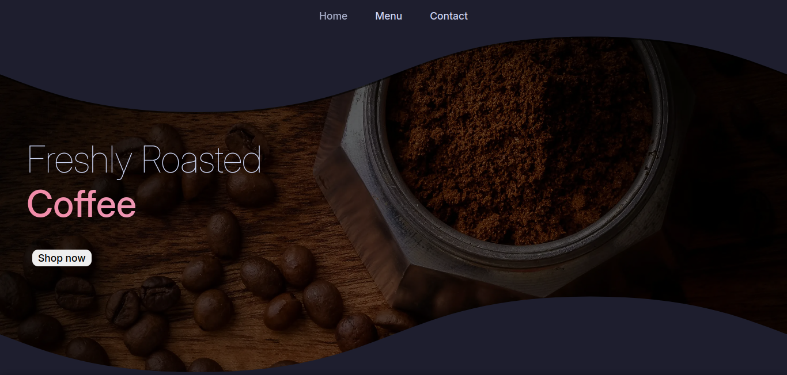

# Restaurant Page
Page made as a practice of handling npm, javascript modules and webpack, following the course [The Odin Project](https://www.theodinproject.com).

## Live:

### Resources:
- Some images are from pinterest
- [minireset.css](https://jgthms.com/minireset.css/)
- [Catppuccin Palette](https://catppuccin.com/palette)
- [Tabler Icons](https://tabler.io/icons)
- [Inter Font](https://fonts.google.com/specimen/Inter)
- [Unsplash](https://unsplash.com/)